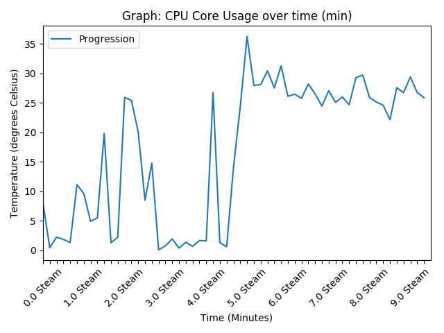

# SysPerfAnalysis
Python Program that analyzes CPU usage, temperature, and the top-running processes at any given time on the computer. I wrote this code in order to test the full capabilities of my brand new gaming pc I built during the summer (brand new gpu, liquid cooling, etc.), and would like to periodically check the state of my PC while playing certain graphically-demanding videogames.

# Three Step Process
The project is broken down into three distinct steps:
* Step 1 - Periodically obtain the hardware performance and process statistics, then record them into files
* Step 2 - Process and parse the raw data obtained in Step 1 and record the desired information into a .csv file
* Step 3 - Present the data obtained in Step 2 in a visual format

This project was developed in Ubuntu 18.04 under Windows 10 WSL (Windows Subsystem for Linux), since it is possible to write code in a linux enviroment yet still run PowerShell commands.

# Step One - getData.py 
Step one requires that we get the PC performance data, which contains two parts: the hardware statistics, and the top running processes on the system.
* The user will first have to specify the name for where all the data will be saved. For example: `python3 getData.py sample1` will tell the program to save all the scraped data into a subdirectory within ./dataFiles/ into a subdirectory called sample1
* We first obtained hardware data from Open Hardware Monitor ([https://openhardwaremonitor.org/]). This software will run on the computer I wanted to test, and makes the hardware statistics available through a rest API. For my computer, the statistics are exposed at `http://192.168.1.18:8085/data.json`. The code periodically does HTTP GET and stores the .json file.
* To get top processes running (measured by CPU usage), I first wrote and tested out a PowerShell script that would be able to retrieve the top 20 processes running on the PC at the time. I then incorporated this into my python code to save the resulting output of that command into a .txt file
* Since one data pull gets both of the above at pretty much the exact same time, I simply named the resulting .json file and the .txt file with the timestamp when the reading took place (predetermined)

Note - I originally began this process of collection with psutil, a python library used for retrieving hardware data from the computer. This was eventually abandoned due to the fact that many of the modules I wanted to use were unavailable for my computer (limited linux and no Windows support being one of the bigger reasons why this was scrapped)

# Step 2 - parseData.py
Step two requires that we parse the data and put it into a .csv file to make it graphable (viewable)
* The user will first have to specify the name of the .csv file to be created, and then the directory where the data is stored. For example, the call `python3 parseData.py table1 sample1` will tell the program to make a .csv file named table1 to pull data from the directory sample1.

* The program must iterate through all files within the above mentioned subdirectory. 
* In order to obtain CPU Core Usage, RAM Used Memmory, GPU Temperature, the program accesses each .json files collected in Step 1 and go through the JSON heirarchy to obtain the elements needed.
* In order to obtain the Top Process, the program accesses the corresponding .txt file (with the top processes) and parses out the name of the top running process.
* All the parsed results (.csv files) will be put into a separate subdirectory `./results/`
* The first row of the .csv file was to be the column names

* By the end, the resulting data would look something like this:

Time|CPU Core Usage|RAM Used Memmory|GPU Temperature|Top Running Process
|---|---|---|---|---|
2019-07-15-22:10:11|8.016666666666667|25.9|43.0|Steam

# Step 3 - graphData.py
Step 3 takes the .csv file created above and creates a graph of a selected field with respect to time
* The user will first have to specify the name of the .csv file that will be modelled into a graph. For example, the call `python3 graphData.py table1` will graph the .csv file named table1
* The user will then be prompted to this display, asking them to type in a number to select what they would like to see:

The 3 Avalialbe items to view are:
 1: CPU Core Usage
 2: RAM (Used Memmory)
 3: GPU Temperature
Enter the number of the option you want to run:

* The top running process at each time interval will be displayed with the time interval in question on the x-axis. The resulting graph will look something like this:

 
* The new graph will be made into a .png, which will be named after the .csv file it was taken from and the option selected. For example, if the the graph was created with data from table1.csv and the user wanted to see the GPU Temperature, the resulting name would be `table1GPUTemperature.png`. The graph was first resized to fit the .png format, and then was saved to Windows Desktop for ease of viewing. If just the name is inputted, the resulting .png will show up in the current directory. 

* The resizing command (to make the graph fit) is `plt.tight_layout()`
* The command I used to put it on my Windows Desktop is `plt.savefig('/mnt/c/Users/Toby/Desktop/Graphs/' + sys.argv[1].split('.')[0] + readings[pickedOption - 1] + '.png')`

* _Originally, the program was designed to show the graph as a popup using the command plotmatlib.show(). However, due to limitations from using a WSL, this command does not work._ This will work, however, on a pure Windows system or MacOS, but for ease of use, the above process was chosen instead

# Additional Information
* This code was originally made to run off of my desktop (gaming) computer. If you would like to run this for yourself, then you will have to change the IP address where applicable
* For ease of testing and parsing, I made specific folders /dataFiles/ and /results/ to stash subdirectories of the pulled data in the former and the .csv files with the processed data in the latter. They are available for import but can be changed at the user's leisure
* To gain privileges to run Powershell commands from Linux vm: `Set-ExecutionPolicy RemoteSigned` (You might have to do this if this is your first time running the code. Run PowerShell x86 as administrator in order to execute this)
* The command line `ps | sort -desc cpu | select -first 20` is the code I used to access the top 20 processes on my computer. This can be modified, although be careful as this is not really a part of the rest of the Python code

# Future Plans (as of 7/19/19)
* Make it all encompassing (one program to do all three steps)

